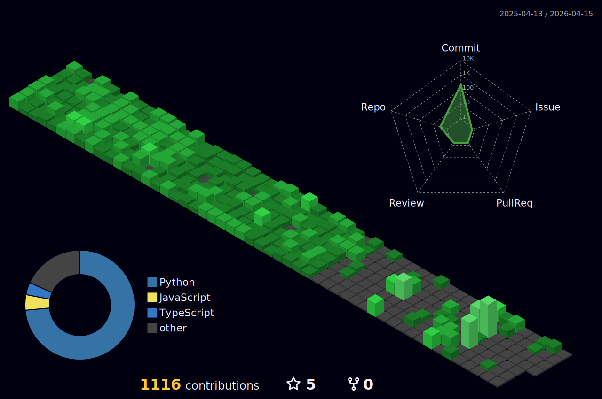

[**Familiar Tech**]()

  <!-- Frontend -->
  
  
  
  
  
  
  
  
  
  

  <!-- Backend -->
  
  
  
  
  

  <!-- Languages -->
  
  
  
  
  
  
  
  
  

  <!-- Databases & Cloud -->
  
  
  
  

  <!-- Tools -->
  
  
  
  
  
  
  
  
  
  
  
  
  
  
  

<table width="100%">
  <tr>

<!-- LEFT COLUMN (leave empty or add something later) -->
<td width="50%" valign="top">
  
   
  
</td>
  </tr>
  
</table>

